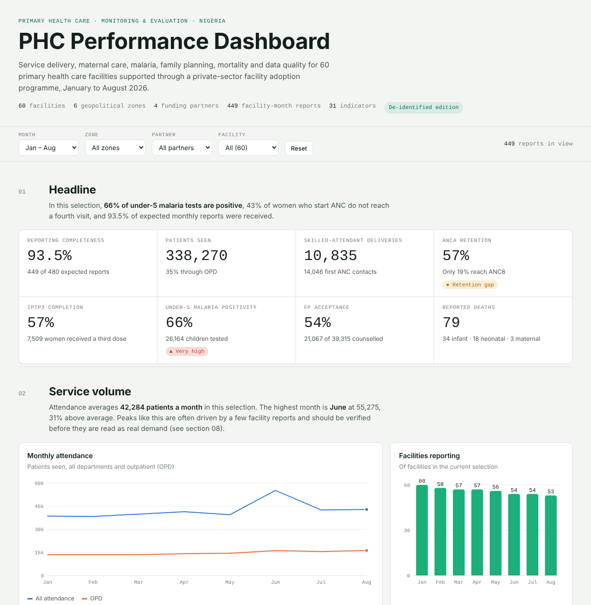
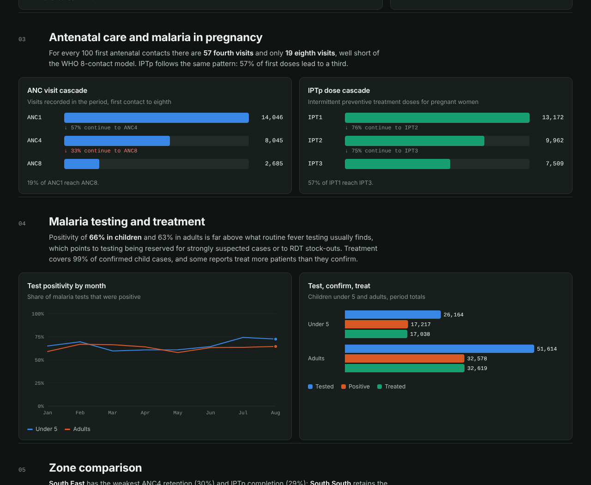

# PHC Performance Dashboard

**Routine health facility data → a decision-ready monitoring dashboard for 60 primary health care facilities in Nigeria (January–August 2026).**

An interactive M&E dashboard covering service volume, antenatal care, malaria in pregnancy, malaria testing and treatment, family planning, mortality, facility-reported barriers and data quality. It is built from 449 monthly facility reports submitted under a private-sector "adopt a health facility" programme with four funding partners across all six geopolitical zones.

> **De-identified portfolio edition.** Facility names are replaced with random codes, funding partners with letters, and state, LGA, ward and all free-text fields are removed. All totals still reconcile exactly with the source workbook.



**Power BI version:** download [`PHC_Performance_Dashboard_PowerBI.zip`](PHC_Performance_Dashboard_PowerBI.zip), unzip it, and open `PHC_Performance_Dashboard.pbip` in Power BI Desktop. The data is built into the model, so just select **Refresh**. It has five report pages, a star-schema model and 55 DAX measures. See [`power-bi/README.md`](power-bi/README.md) for details.

**Web version:** [`PHC_Performance_Dashboard.html`](PHC_Performance_Dashboard.html) is the same dashboard as a single file that opens in any browser. The screenshots below are from this version.

---

## The problem

Programme staff had a large Excel workbook of monthly facility reports. It held the right data, but answering basic questions took hours:

- Are facilities still reporting, and are the numbers credible?
- Where do women drop out of antenatal care?
- Is malaria testing and treatment working as it should?
- What do facilities say is holding them back?
- Which facilities need a supervision visit first?

## What I did

1. **Cleaned and standardised the raw data.** I harmonised partner names that had been entered seven different ways, imputed five blank partner fields from the facility's other months, converted text zeros ("Nil", "None", "O") to numbers, merged facility-name variants, and documented every transformation in a source-mapping sheet.
2. **Built an indicator framework.** 31 indicators, each summed across facility-month reports and never averaged, plus 9 derived rates such as ANC4 retention, IPTp3 completion, malaria test positivity, treatment coverage and FP acceptance.
3. **Designed automated data-quality checks.** Seven rules run on every record: positives exceeding tests, treatments exceeding confirmed cases, acceptors exceeding counselled clients, missing method breakdowns, zone entry errors, and spikes above 3× a facility's own median month (outside the June outreach month, when high volumes are expected).
4. **Coded 237 distinct free-text challenge answers** into 11 themes with transparent keyword rules.
5. **Built the dashboard in Power BI** with a star-schema model (one fact table, Facility and Month dimensions, a challenge-theme bridge) and 55 DAX measures in display folders. Month, zone and partner slicers stay in sync across five pages. I also built a single-file web version in HTML and JavaScript for clients without Power BI.
6. **De-identified the data** for public sharing with a reproducible pipeline ([`scripts/build_dataset.py`](scripts/build_dataset.py)) that refuses to write output if any source name leaks.

## Key findings

| Area | Finding |
|---|---|
| **Reporting** | 93.5% completeness overall, but facilities reporting fell steadily from 60 in January to 53 in August. |
| **Antenatal care** | 57 fourth visits and only 19 eighth visits per 100 first contacts, far short of the WHO 8-contact model. The South East retains just 30% to ANC4. |
| **Malaria in pregnancy** | 57% of IPT1 doses lead to IPT3; the South East is lowest at 29%. |
| **Malaria testing** | 66% of under-5 tests and 63% of adult tests are positive. Positivity this high suggests testing is reserved for strongly suspected cases, or RDTs are running short, a hypothesis supported by facilities reporting RDT stock-outs. |
| **Treatment** | Treatment covers 99% of confirmed child cases, but 15 reports treat more patients than they confirm, which points to presumptive treatment. |
| **June immunisation outreach** | The June outreach delivered 31,477 immunisation doses, 2.1× the 15,039 average of the other months, and lifted overall attendance to 55,275 (31% above the monthly average). Six facilities account for nearly half of the June doses, showing where the outreach reached most children. |
| **Barriers** | 53% of answered reports name a challenge. Infrastructure (36%), power (35%) and staffing (28%) lead; many facilities describe solar systems and boreholes broken for months. |
| **Data quality** | 33 records fail at least one consistency or outlier check, and 277 reports give FP acceptors with no method breakdown. Seven facilities had their zone entered wrongly in one month. |



## What the dashboard includes

The Power BI report covers the same ground across five pages: Overview, Maternal & malaria, Zones & facilities, FP, mortality & barriers, and Data quality. The web version is laid out as nine sections:

| Section | Purpose |
|---|---|
| 01 Headline | Eight KPI tiles with status pills for figures that need attention |
| 02 Service volume | Attendance trend and facilities reporting per month |
| 03 Antenatal care | ANC1→4→8 and IPT1→2→3 cascades showing where women drop out |
| 04 Malaria | Positivity trend and the test → confirm → treat chain for children and adults |
| 05 Zone comparison | Sortable table of rates across all six zones |
| 06 FP and mortality | Method mix with a completeness note, and deaths by category |
| 07 Barriers | Coded challenge themes |
| 08 Data quality | A 60 × 8 reporting grid with flagged cells, and a check-by-check failure count |
| 09 Facility table | A sortable, searchable list for prioritising supervision visits |

Every chart has hover tooltips. The layout works on phones and in light and dark themes, and the colour palette is checked for colour-blind safety.

## Repository layout

```
phc-performance-dashboard/
├── PHC_Performance_Dashboard_PowerBI.zip  # Power BI project, ready to open
├── power-bi/                          # the same Power BI project, unzipped
├── PHC_Performance_Dashboard.html     # single-file web version (data built in)
├── index.html                         # the dashboard source
├── data/
│   ├── phc_2026_deidentified.csv      # 449 facility-month records, 50 columns
│   └── phc_2026_deidentified.js       # same data, loaded by the dashboard
├── scripts/build_dataset.py           # cleaning + de-identification pipeline
├── scripts/build_standalone.py        # bundles index.html + data into one file
├── scripts/build_powerbi.py           # generates the Power BI project
└── assets/                            # screenshots
```

Rebuild the dataset from a source workbook:

```bash
pip install pandas openpyxl
python scripts/build_dataset.py path/to/source.xlsx
python scripts/build_standalone.py
python scripts/build_powerbi.py
```

## Method notes and limitations

- Rates are ratios of sums. ANC and IPTp cascades compare visits and doses recorded in the same period, not a tracked cohort of women.
- "Fully immunised children <1" in the source is a sum of antigen doses (BCG, Penta 1–3, Vitamin A, MCV1), so it counts doses, not children. The dashboard labels it accordingly.
- Mortality counts are small and the four categories are reported separately, so one death may appear in more than one field. Read them as signals for review, not rates.
- Challenge themes are keyword-coded; a report can carry several themes.
- Zone-level figures use each facility's usual zone, so they can differ slightly from a table built on the raw zone column.

## Skills demonstrated

`Power BI` `DAX` `Power Query (M)` `Data Modelling` `Monitoring & Evaluation` `Health Information Systems` `Data Cleaning` `Indicator Design` `Data Quality Assurance` `Qualitative Coding` `Data Visualisation` `Python (pandas)` `JavaScript` `Data Privacy & De-identification`

---

**Abi Precious Jibrin**, public health and One Health data analyst. Open to M&E, dashboard and health data analysis work. [github.com/hellojibriva](https://github.com/hellojibriva)
