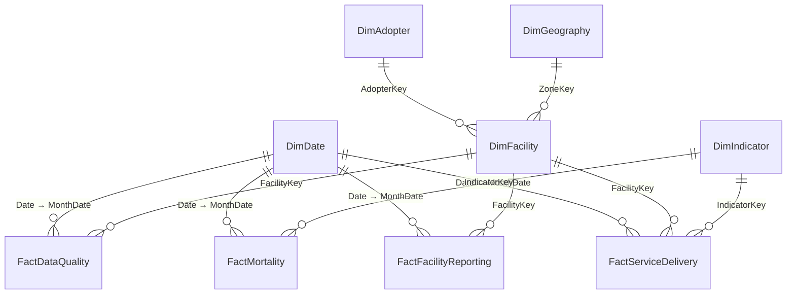

# Power BI data model

Star schema with two snowflaked attributes (adopter and zone hang off the facility). All relationships are **one-to-many and single-direction**: there are no many-to-many or bidirectional filters.

## Tables

| Table | Grain | Rows | Key(s) | Notes |
|---|---|---|---|---|
| FactServiceDelivery | facility × month × indicator | 14,580 | FacilityKey, MonthDate, IndicatorKey | `Value` is nullable (missing ≠ 0); `ValueStatus` explains every value |
| FactFacilityReporting | facility × month | 540 | FacilityKey, MonthDate | `Expected`, `Reported` (0/1), `ReportingStatus` |
| FactMortality | month × indicator (national) | 45 | MonthDate, IndicatorKey | no facility key, by design (privacy) |
| FactDataQuality | facility × month × check | 315 | FacilityKey, MonthDate, CheckCode | DQ01–DQ11 exceptions |
| DimFacility | facility | 60 | FacilityKey | pseudonym, AdopterKey, ZoneKey |
| DimAdopter | adopter | 4 | AdopterKey | pseudonym |
| DimGeography | zone | 7 | ZoneKey | 6 zones + "Not disclosed (small cell)"; sort by ZoneSort |
| DimIndicator | indicator | 32 | IndicatorKey | category, unit, sort order, first month captured |
| DimDate | day (1 Jan–31 Dec 2026) | 365 | Date | built in Power Query; **Mark as date table**; facts join on the first day of the month |
| Measures | – | – | – | empty table holding all 84 measures (Home › Enter data › name it `Measures`, then delete its dummy column) |

## Relationship settings (Model view)

| From (many) | To (one) | Cardinality | Cross-filter |
|---|---|---|---|
| FactServiceDelivery[MonthDate] | DimDate[Date] | *:1 | Single |
| FactFacilityReporting[MonthDate] | DimDate[Date] | *:1 | Single |
| FactDataQuality[MonthDate] | DimDate[Date] | *:1 | Single |
| FactMortality[MonthDate] | DimDate[Date] | *:1 | Single |
| FactServiceDelivery[FacilityKey] | DimFacility[FacilityKey] | *:1 | Single |
| FactFacilityReporting[FacilityKey] | DimFacility[FacilityKey] | *:1 | Single |
| FactDataQuality[FacilityKey] | DimFacility[FacilityKey] | *:1 | Single |
| DimFacility[AdopterKey] | DimAdopter[AdopterKey] | *:1 | Single |
| DimFacility[ZoneKey] | DimGeography[ZoneKey] | *:1 | Single |
| FactServiceDelivery[IndicatorKey] | DimIndicator[IndicatorKey] | *:1 | Single |
| FactMortality[IndicatorKey] | DimIndicator[IndicatorKey] | *:1 | Single |

## Column settings

- Hide every key column and every fact column used only by measures (`Value`, `Expected`, `Reported`, `Deaths`). Users work with measures and dimension labels only, which prevents implicit aggregation.
- Sort `DimDate[Month Name]` and `[Month Short]` by `[Month Number]`; sort `DimGeography[Zone]` by `[ZoneSort]`; sort `DimIndicator[Indicator]` by `[SortOrder]`.
- Set `Summarize by: None` on all numeric attribute columns (`FacilitiesInProgramme`, `SortOrder`, `ZoneSort`, `Month Number`, `Year`).
- Data category: none of the geography is mapped to lat/long. No coordinates are published.

## Why these choices

- **Long (unpivoted) service fact.** One row per facility-month-indicator supports the Service-category slicer, indicator completeness and a single `Service Value` base measure. Each KPI measure pins its indicator with `REMOVEFILTERS('DimIndicator')`, so KPI cards are not blanked by the category slicer.
- **Separate reporting fact.** Reporting is a facility-month fact; storing it once avoids counting reports 27 times through the service fact.
- **Two reporting grains are never joined row-to-row.** Measures combine them only after aggregation (e.g. *General Attendance per Report*), so nothing is double-counted.
- **National-only mortality.** The guard in each mortality measure blanks the value under facility, adopter or zone filters, because the table cannot answer those questions.
